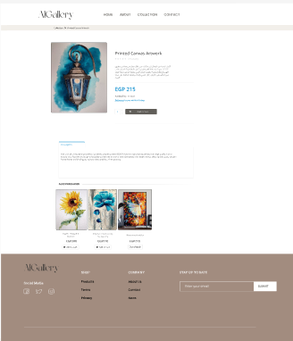

# AlGallery Store Website

An **e-commerce web application** for managing an online art gallery store. The project includes features for user authentication, product browsing, shopping cart, and order management.  

---

## Table of Contents
1. [About the Project](#about-the-project)  
2. [Features](#features)  
3. [Tech Stack](#tech-stack)  
4. [Screenshots](#screenshots)  
5. [Installation](#installation)  
6. [Usage](#usage)  
7. [Project Structure](#project-structure)  
8. [Contributing](#contributing)  
9. [License](#license)

---

## About the Project
AlGallery is a **full-stack web application** built using ASP.NET Core MVC.  
It provides a smooth shopping experience, secure user authentication, and a clean UI for browsing and purchasing art products.

---

## Features
- **User Authentication** (Login/Register using Identity).  
- **Product Management** (CRUD for admin).  
- **Shopping Cart** with add/remove/update items.  
- **Order & Payment Management**.  
- **Responsive UI** for both desktop and mobile.  

---

## Tech Stack
- **Backend:** ASP.NET Core MVC, Entity Framework Core  
- **Frontend:** Razor Pages, Bootstrap, CSS, JavaScript  
- **Database:** SQL Server  
- **Authentication:** ASP.NET Core Identity  

---

## Screenshots
### Homepage


### Product Page

 
### Collection Page

 
 

## Installation
To run this project locally:
```bash
# Clone the repository
git clone https://github.com/yourusername/AlGallery.git

# Navigate to the project folder
cd AlGallery

# Restore dependencies
dotnet restore

# Apply migrations (make sure SQL Server is running)
dotnet ef database update

# Run the project
dotnet run
```

---

## Usage
- **Admin Login:** Allows adding/updating products.  
- **User:** Can browse products, add to cart, and checkout.

---

## Project Structure
```
AlGallery/
├── Controllers/
├── Models/
├── Views/
├── Migrations/
├── wwwroot/
└── Program.cs
```

---

## Contributing
Contributions are welcome!  
1. Fork the repository.  
2. Create a new branch (`feature-xyz`).  
3. Commit your changes.  
4. Open a pull request.  

---

## Author
**Hadeer Badr Hassan**  

